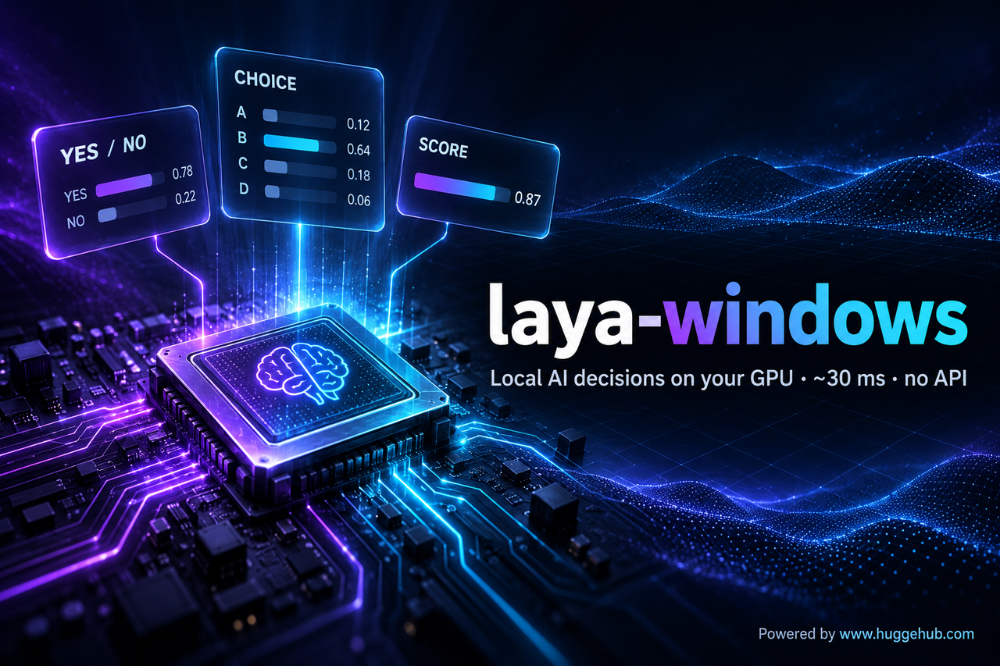
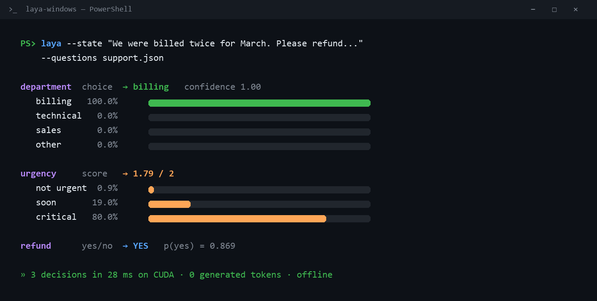
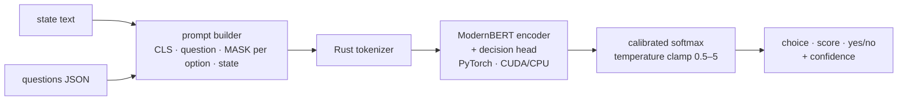

<div align="center">



# laya-windows

**Yes/no, multiple-choice and score decisions from a local AI model — on any Windows or Linux PC.**
<br>No API keys. No credits. No generated tokens. ~30 ms on a laptop GPU.

[](https://github.com/astrodevit-creator/laya-windows/actions/workflows/ci.yml)


[](https://www.huggehub.com)

[Quickstart](#-quickstart) · [Examples](#-examples) · [Benchmarks](#-benchmarks) · [How it works](#-how-it-works) · [Claude Code skill](#-use-it-as-a-claude-code-skill)



<sub>Real output, rendered by <code>scripts/render_demo.py</code> — nothing hand-edited.</sub>

</div>

---

## ✨ Why

LLMs are great at writing, but slow and expensive when all you need is a **decision**:
*Is this a refund request? Which team gets this ticket? How urgent is it? Is this comment spam?*

[Laya](https://github.com/NandhaKishorM/laya) is a small multilingual model trained for exactly that. It
reads your text and question, then returns **calibrated probabilities** in a single forward pass.
There's no free text to parse and nothing to hallucinate into your JSON.

The popular [`laya-coreml`](https://github.com/mizorewww/laya-coreml) runtime only works on Apple
Silicon. **laya-windows brings it to Windows and Linux**, running on PyTorch with CUDA or CPU, and
matches the upstream model's outputs to within about 2e-5.

| | |
|---|---|
| 🎯 **3 question types** | `choice` (pick one), `score` (ordinal scale), `noul` (yes/no) |
| 🌍 **Multilingual** | Verified on English, French, German, Spanish, Chinese, Japanese, Hindi and Russian |
| ⚡ **Fast** | ~30 ms for 3 questions on an RTX 4050 laptop GPU, ~0.4 s on CPU |
| 🔒 **Private & offline** | Weights are downloaded once, then everything runs on your machine |
| 🧪 **Verified** | Token-for-token and logit-level parity with the unmodified upstream model |
| 🤖 **Agent-ready** | CLI with JSON output, a Python API, and a drop-in Claude Code skill |

## 🚀 Quickstart

```powershell
git clone https://github.com/astrodevit-creator/laya-windows
cd laya-windows
uv venv --python 3.12 .venv
uv pip install --python .venv/Scripts/python.exe torch --index-url https://download.pytorch.org/whl/cu124   # or /whl/cpu
uv pip install --python .venv/Scripts/python.exe -e .
```

```powershell
.venv/Scripts/laya --state "I was billed twice, please refund me" --questions examples/questions.json
```

The first run downloads `convaiinnovations/laya-multilingual` (~640 MB, pinned revision). After that,
add `--offline`.

## 🐍 Python API

```python
from laya_windows import load

agent = load()  # CUDA if available, otherwise CPU
result = agent.predict(
    "Combien le prix avec livraison à Casablanca ?",
    {
        "intent": {
            "type": "choice",
            "instructions": "What does this comment want?",
            "criteria": {"purchase": "wants to buy", "complaint": "unhappy",
                         "question": "asks about the product", "spam": "unrelated promotion"},
        }
    },
)
print(result["answers"]["intent"]["choice"])  # -> "question"
```

### Question types

| type | `criteria` | returns |
|---|---|---|
| `choice` | `["a", "b"]` or `{"a": "description", ...}` | `choice`, `probabilities`, `confidence` |
| `score` | `["level 0 text", "level 1 text", ...]` | `score` (expected level), `probabilities` |
| `noul` | optional `{"false": "...", "true": "..."}` | `noul` = P(yes), `confidence` |

## 📚 Examples

| Script | What it does |
|---|---|
| [`examples/questions.json`](examples/questions.json) | Support-email routing: department, urgency and refund |
| [`examples/moderate_comments.py`](examples/moderate_comments.py) | Triage multilingual social comments into purchase / complaint / question / spam |

## 📊 Benchmarks

Measured on a laptop with an RTX 4050 (6 GB) and a Ryzen 5 8645HS, PyTorch 2.6 + CUDA 12.4,
Windows 11:

| Device | Model load | 3 questions (1 call) |
|---|---|---|
| RTX 4050 (CUDA) | ~3.3 s | **~29 ms** |
| CPU (Ryzen 5) | ~2.6 s | ~410 ms |

**Parity** (`python tests/parity.py --device cuda|cpu`): 16/16 reference cases pass on both devices,
with identical token ids and a max logit difference of 2.4e-5 against golden outputs from the upstream
Laya package. The cases cover 9 languages, empty state, long input, 20 options and structured JSON.

## 🧠 How it works



One forward pass scores every option at once, because each option gets a `[MASK]` marker whose
hidden state the scorer reads. Calibration temperatures are clamped to `[0.5, 5.0]`. That's the
upstream v0.3.5 fix that stops a coin flip from being reported as near-certainty.

## 🤖 Use it as a Claude Code skill

Copy `SKILL.md` into `~/.claude/skills/laya/`. Your agent can then run cheap local classification
and gating: comment moderation, lead triage and ticket routing, without spending API credits.

> **Rule of thumb:** treat `confidence < 0.7` as "ask a bigger model or a human". Laya is a fast
> classifier, not a policy engine, so don't make it the only gate for spending, deleting or publishing.

## ⚠️ Limitations

- Maximum of 512 tokens per question (question + options + state). Longer state is truncated.
- It's a compact classifier. Nuanced judgments such as sarcasm or subtle sentiment can be low-confidence or wrong, so check `confidence`.
- CUDA wheels are about 2.5 GB. If download size matters, use the CPU wheel.

## 🗺️ Roadmap

- [ ] ONNX Runtime / DirectML backend (AMD & Intel GPUs, smaller install)
- [ ] Batched `predict_many()` for high-throughput queues
- [ ] PyPI package
- [ ] Local HTTP server mode

## 🙏 Credits

- **Model & method:** [Laya](https://github.com/NandhaKishorM/laya) by Convai Innovations. The weights belong to their authors and are downloaded separately.
- **Runtime this is ported from:** [laya-coreml](https://github.com/mizorewww/laya-coreml) and [laya-mlx](https://github.com/mizorewww/laya-mlx). Prompting, calibration, result formatting and the PyTorch graph are reused as-is under Apache-2.0.

This is an independent port, not an official Convai Innovations release. See [NOTICE](NOTICE).

<div align="center">

**⚡ Powered by [www.huggehub.com](https://www.huggehub.com)**

<sub>Built with ❤️ in Morocco · Apache-2.0</sub>

</div>
